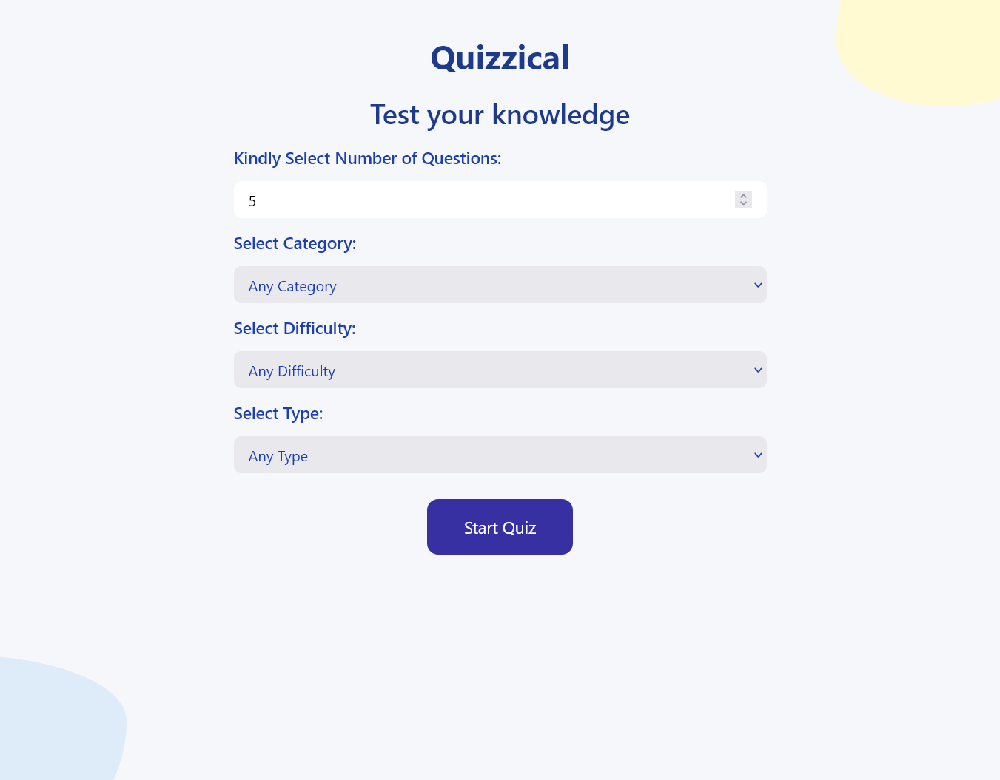
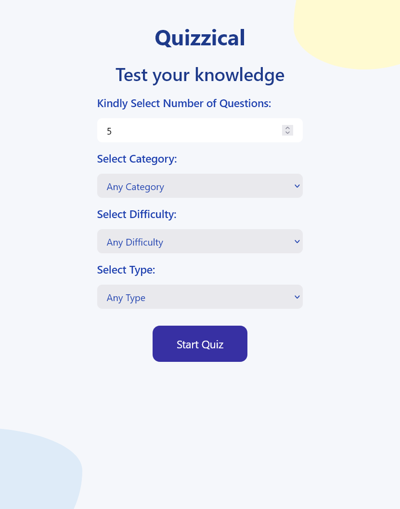
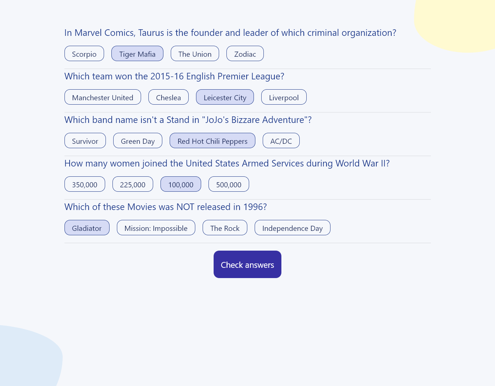
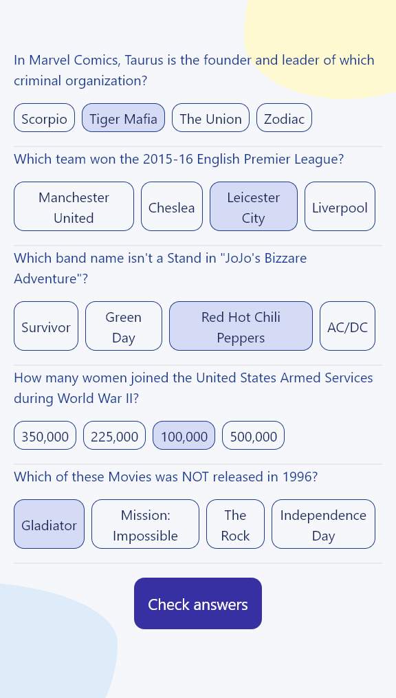
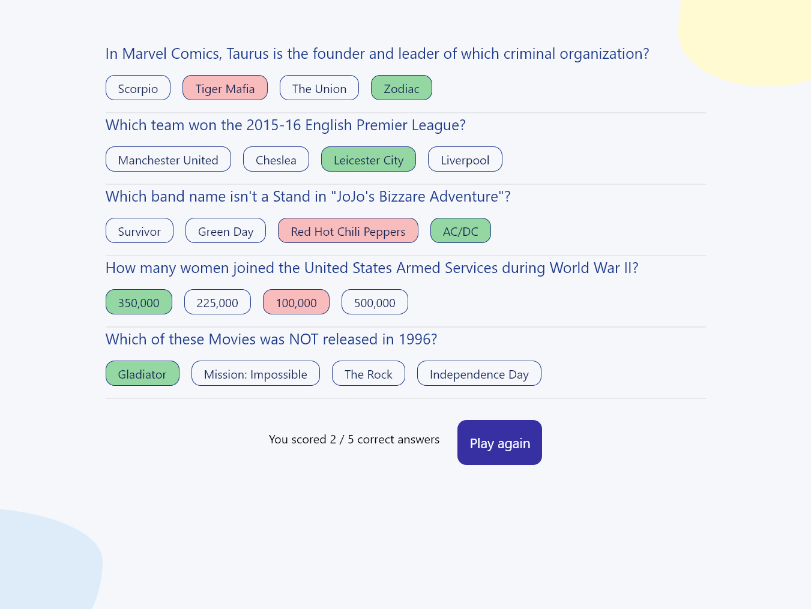
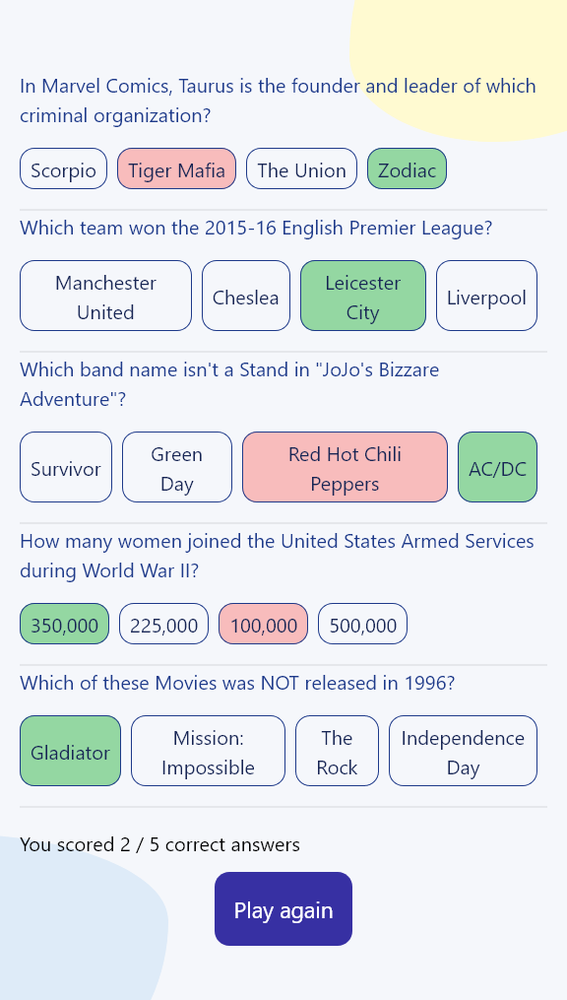

# Quizzical

This project idea was discovered on: [Scrimba](https://scrimba.com/learn/learnreact).

## Details

This project makes use of the [Open Trivia Database API](https://opentdb.com).
It allows a user to retrieve random questions based on the user selection of category, difficulty and type.

The default number of questions is 5 but you can increase to 20 or decrease to 1.
The user can select one answer for each given questions, and then validate if their chosen answers are correct.
At the end the number of correctly answered questions will be shown to the user.

## Install & Run

1. Clone the repo to your local machine
2. Navigate to the appropriate folder
3. Install all the required packages with `npm install`
4. Run with `npm start`

## Demo App

### Home Page

### Questions Page

### Score Page

